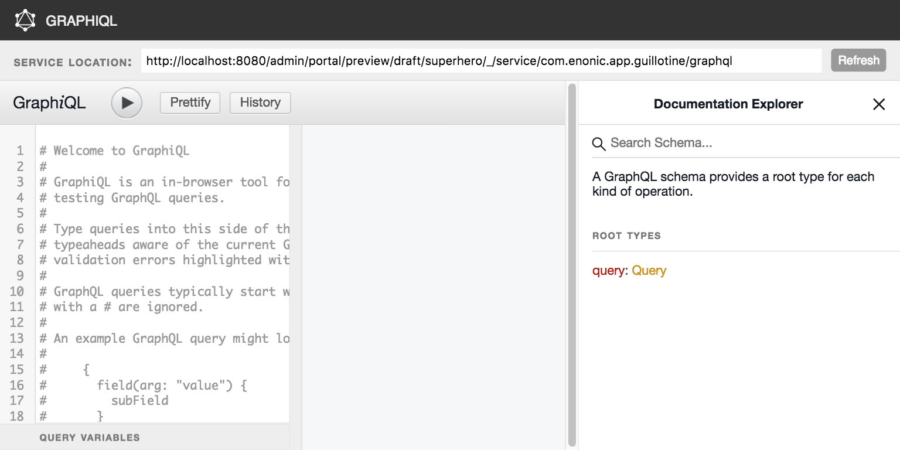
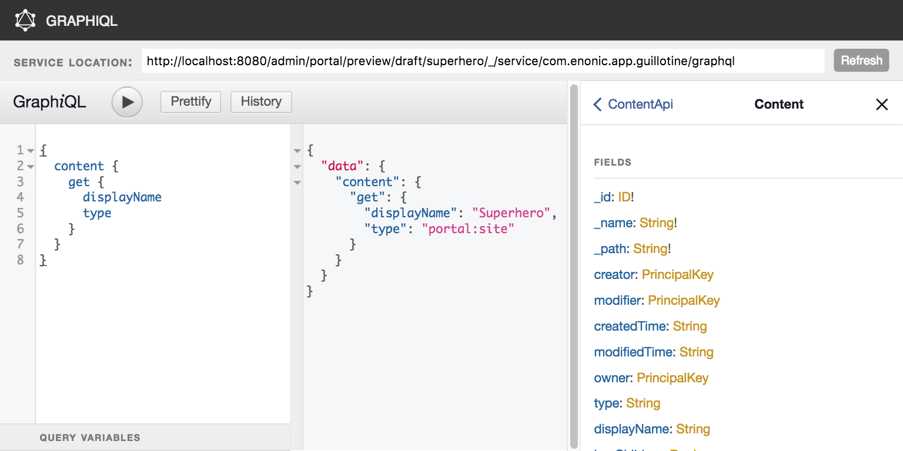
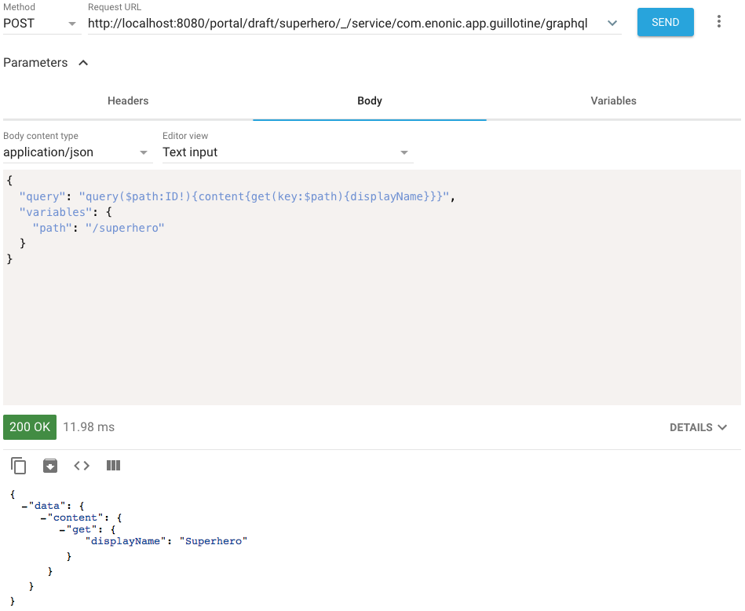
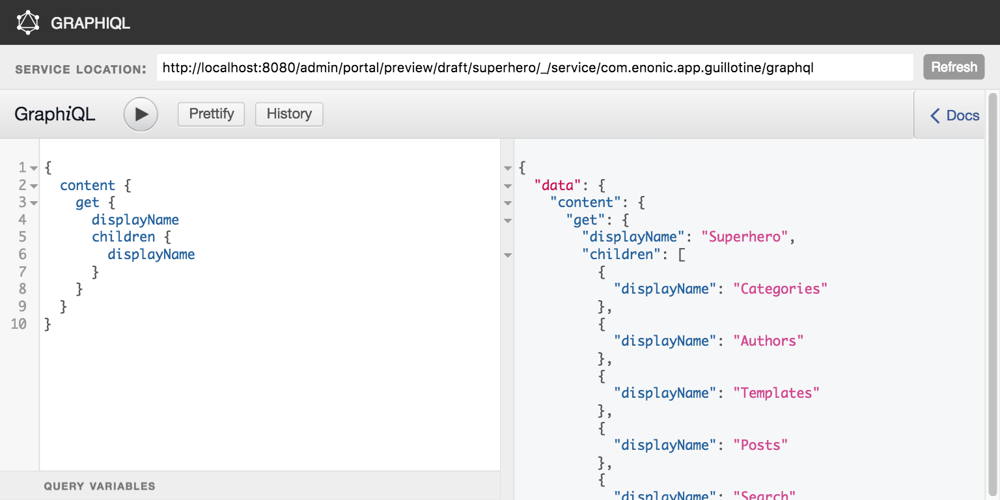
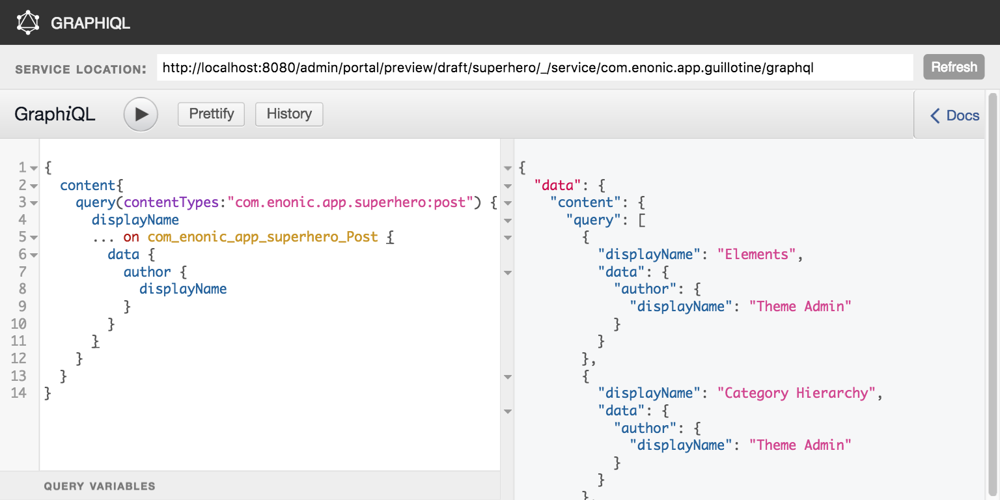
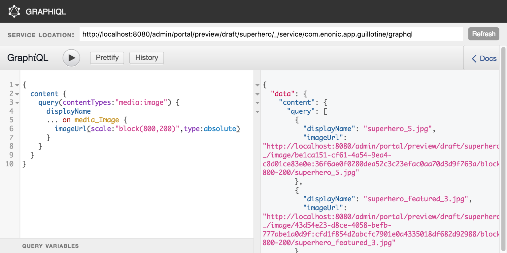
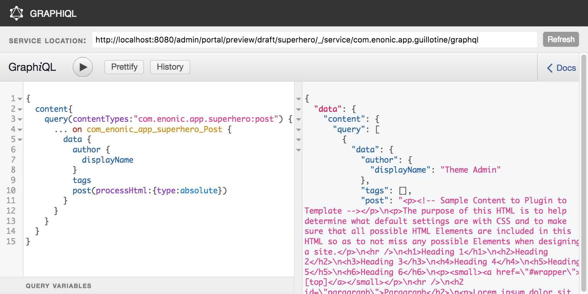

= Usage
:toc: macro

Once a site is configured, a service "graphql" is present under the site path: "/mysite/mypage/_/service/com.enonic.app.guillotine/graphql".

toc::[]

== GraphiQL

The easiest way to manually explore a GraphQL API and test queries is to use GraphiQL

=== Installation 

* Open the admin tool 'Applications'
* Search for the 'graphiql' application
* Click install
* Open the admin tool 'GraphiQL'

=== User Interface

* The field 'Service Location' specifies the location of the GraphQL service. 
+
By default it is prefilled with one of your configured sites and for the branch draft.
* The left panel allows you to edit your graphQL query
* The center panel displays the result of the query execution
* The right panel is used to display a documentation generated from the GraphQL API.

=== Usage example

* Write the query below inside the left panel.
+
This query can be read as: Retrieve the display name and type of the current content.
* Click on the query execution button above
* The service response is displayed in the center panel

----
{
  content {
    get {
      displayName
      type
    }
  }
}
----

== Application

To use the Guillotine API, your application will send all its request to the GraphQL service: 
"/mysite/mypage/_/service/com.enonic.app.guillotine/graphql"

The service is expecting to receive a POST request with inside its body:

* A mandatory "query" String
* An optional "variables" Object

== Relations

Multiple relations are generated to allow to navigate between contents.
By default each content has the following relations:

* parent: Link to the parent content 
* children: Link to the child contents
* site: Link to the nearest site

On top of that, every ContentSelector, MediaUploader, AttachmentUploader or ImageSelector defined in your content type definitions will 
be converted to a link to the linked content.

=== Example: Children

Query example: Retrieve the display name of the current content and the display name of its direct children

----
{
  content {
    get {
      displayName
      children {
        displayName
      }
    }
  }
}
----

=== Example: ContentSelector

Query example: Retrieve the blog posts. For each post, return its display name and the display name of the related author

----
{
  content{
    query(contentTypes:"com.enonic.app.superhero:post") {
      displayName
      ... on com_enonic_app_superhero_Post {
        data {          
          author {
            displayName
          }
        }
      }
    }
  }
}
----

== Image

Enonic XP allows to edit images at runtime. Every image content contains a field "imageUrl" generates a URL pointing to a processed image.

=== Example: Scaled Image URL
Query example: Retrieve the image contents and generate an absolute URL to these images cropped to 800x200px

----
{
  content {
    query(contentTypes:"media:image") {
      displayName
      ... on media_Image {
        imageUrl(scale:"block(800,200)",type:absolute)
      }
    }
  }
}
----

== HTML

HTML fields are generated with a parameter "processHtml" allowing to replace abstract internal links by generated URLs. 

=== Example: Process HTML

Query example: Retrieve the Superhero blog posts. For each post, return its author display name, tags and processed content.

----
{
  content{
    query(contentTypes:"com.enonic.app.superhero:post") {
      ... on com_enonic_app_superhero_Post {
        data {
          author {
            displayName
          }
          tags
          post(processHtml:{type:absolute})
        }
      }
    }
  }
}
----

