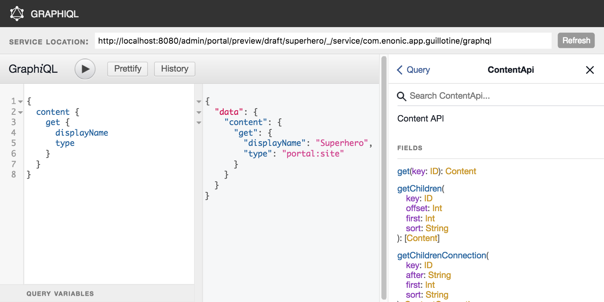

= Usage
:toc: macro

Once a site is configured, a service "graphql" is present under the site path: "/mysite/mypage/_/service/com.enonic.app.guillotine/graphql".

toc::[]

== GraphiQL

The easiest way to manually explore a GraphQL API and test queries is to use GraphiQL

=== Installation 

* Open the admin tool 'Applications'
* Search for the 'graphiql' application
* Click install
* Open the admin tool 'GraphiQL'

image::img/graphiql.png[GraphiQL,768,384]

=== User Interface

* The field 'Service Location' specifies the location of the GraphQL service. 
+
By default it is prefilled with one of your configured sites and for the branch draft.
* The left panel allows you to edit your graphQL query
* The center panel displays the result of the query execution
* The right panel is used to display a documentation generated from the GraphQL API.

=== Usage example

* Write the query below inside the left panel.
+
This query can be read as: Retrieve the display name and type of the current content.
* Click on the query execution button above
* The service response is displayed in the center panel

----
{
  content {
    get {
      displayName
      type
    }
  }
}
----

== Application

To use the Guillotine API, your application will send all its request to the GraphQL service: 
"/mysite/mypage/_/service/com.enonic.app.guillotine/graphql"

The service is expecting to receive a POST request with inside its body:

* A mandatory "query" String
* An optional "variables" Object

image::img/service.png[Request]

== Examples

=== Recursivity

Query example: Retrieve the display name of the current content and its direct children

----
{
  content {
    get {
      displayName
      children {
        displayName
      }
    }
  }
}
----

image::img/example2.png[Example 2,768,384]

=== Query & Image

Query example: Retrieve the image contents and generate a URL to these images cropped to 800x200 px

----
{
  content {
    query(contentTypes:"media:image") {
      displayName
      ... on media_Image {
        imageUrl(scale:"block(800,200)",type:absolute)
      }
    }
  }
}
----

image::img/example3.png[Example 3,768,384]