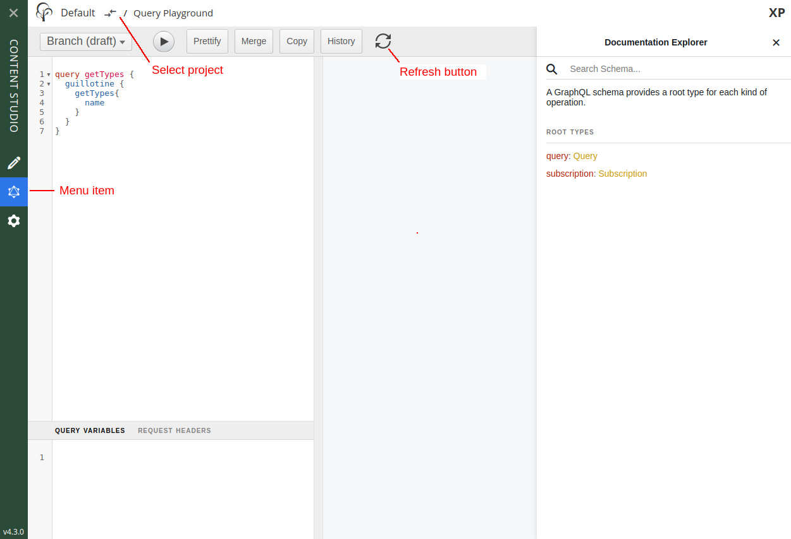

= Clients

There are GraphQL clients for virtually any programming language and platform. This section describes the most common ways of accessing the API

NOTE: The examples below assume you have installed the https://market.enonic.com/vendors/enonic/headless-movie-db[Headless Movie Database] demo app running on your local machine.

== Query Playground

The Guillotine app extends Content Studio with a new panel called Query Playground. This is only accessible for users with `system.admin` or `cms.admin` roles.

Query Playground lets you run queries in context of your content. You may choose to query either the draft items (draft branch), or the published items (master branch).

* The left panel allows you to edit your GraphQL query
* The center panel displays the result of the query execution
* The right panel is used to display documentation generated from the GraphQL API.
* The toolbar is extended by the dropdown for choosing the branch and the refresh button, which allows to re-generate a schema
* Each query is executed in a specific context, which is determined by the repository and the branch

Starting from the version 6.2.0 Guillotine was updated to use GraphiQL 2 with a new enhanced UI.

* The left panel is used to display documentation generated from the GraphQL API
* The center panel allows you to edit your GraphQL query
* The right panel displays the result of the query execution
* Branch selector (Draft/Master) can be found in the top right corner
* Each query is executed in a specific context, which is determined by the project and the branch

image::images/graphiql2-ide.png[Query playground interface]

=== Query example

* Paste the query below inside the left panel.
+
This query can be read as: Retrieve the display name and type of the root items.
* Click on the query play button above
* The service response is displayed in the center panel

.getSite
[source,graphQL]
----
{
  guillotine{
 		getChildren(key:"/") {
 		displayName
 		}
 	}  
}

----

=== Subscription example

Guillotine also enables you to use GraphQL subscription in order to listen to events from the server.

The subscriptions are implemented using Websockets, providing instant and high performance streaming of events over HTTP.

[source,graphQL]
.Listen to server events for the specific site
----
subscription {
  event {
    type
    dataAsJson
  }
}
----

Just like for regular queries, Guillotine listens to events only for the contextual repository and branch

== cURL

TIP: cURL must be installed on your device for the examples below to work

=== Query example

.Create the file req.json
[source,json]
----
{
  "query": "query getPlaylist {\n guillotine {\n query(query: \"type='com.enonic.app.hmdb:playlist'\") {\n ... on com_enonic_app_hmdb_Playlist {\n  _id\n }\n }\n }\n}",
  "variables": null,
  "operationName": "getPlaylist"
}
----

.POST request using cURL
[source,curl]
----
curl -X POST -H "Content-Type: application/json" -d @req.json http://localhost:8080/site/hmdb/draft | json_pp
----

.Response
[source,json]
----
{
   "data" : {
      "guillotine" : {
         "query" : [
            {
               "_id" : "531e40c9-6e5b-4259-b9e0-0d3144b2382a"
            }
         ]
      }
   }
}
----

=== Subscription example

.Handshake request

[source,curl]
----
curl -X GET -i -N -H "Connection: Upgrade" \
                  -H "Upgrade: websocket" \
                  -H "Host: localhost:8080" \
                  -H "Origin: http://localhost:8080" \
                  -H "Sec-WebSocket-Protocol: graphql-transport-ws" \
                  -H "Sec-WebSocket-Key: c29tZWtleQ==" \
                  -H "Sec-WebSocket-Version: 13" \
                  --http1.1 \
                 http://localhost:8080/site/hmdb/draft
----

.Handshake response

[source,curl]
----
HTTP/1.1 101 Switching Protocols
Date: Fri, 24 Jun 2022 15:09:08 GMT
X-Frame-Options: DENY
X-XSS-Protection: 1; mode=block
X-Content-Type-Options: nosniff
Sec-WebSocket-Protocol: graphql-transport-ws
Connection: Upgrade
Sec-WebSocket-Accept: eXT5yQBZ/TOhFBUi6nLY8cfzs1s=
Upgrade: WebSocket
----

To send a message to the WS server in the terminal let's use https://www.npmjs.com/package/wscat[wscat], if WebSocket Cat is not installed, please use the following command:

[source]
----
npm install -g wscat
----

Then run the following command in the terminal:

[source,curl]
----
> wscat -c ws://localhost:8080/site/hmdb/draft
Connected (press CTRL+C to quit)
> {"id":"myid","type":"subscribe","payload":{"query":"subscription {\n  event {\n    type\n    dataAsJson\n  }\n}","variables":null}}
< {"type":"next","id":"myid","payload":{"data":{"event":{"type":"node.updated","dataAsJson":{"nodes":{"0":{"id":"b028f04b-b020-4ef1-92eb-d4e657359dae","path":"/content/hmdb/dir","branch":"draft","repo":"com.enonic.cms.hmdb"}}}}}}}
< {"type":"next","id":"myid","payload":{"data":{"event":{"type":"node.renamed","dataAsJson":{"nodes":{"0":{"id":"b028f04b-b020-4ef1-92eb-d4e657359dae","path":"/content/hmdb/dir-renamed","branch":"draft","repo":"com.enonic.cms.hmdb","newPath":"/content/hmdb/dir-renamed"}}}}}}}
----

== JavaScript

This section describes how to access the Guillotine API directly from a JavaScript client.

=== Example: Fetch content by path

To use your GraphQL service, your client will send all its requests to the same service. The endpoint is expecting to receive a POST request with the following body:

* A mandatory "query" String
* An optional "variables" Object
* An optional "operationName" String

.Example: Fetch data from a javascript client
[source,javascript]
----
const query = `query($path:ID!){
    guillotine {
        get(key:$path) {
            displayName
            type
        }
    }
}`;

const variables = {
    'path': '/mysite/mycontentpath'
};

fetch('{{graphqlServiceUrl}}', {
    method: 'POST',
    body: JSON.stringify({
        query: query,
        variables: variables
    }),
    credentials: 'same-origin'
})
    .then(response => response.json())
    .then(console.log);
----
