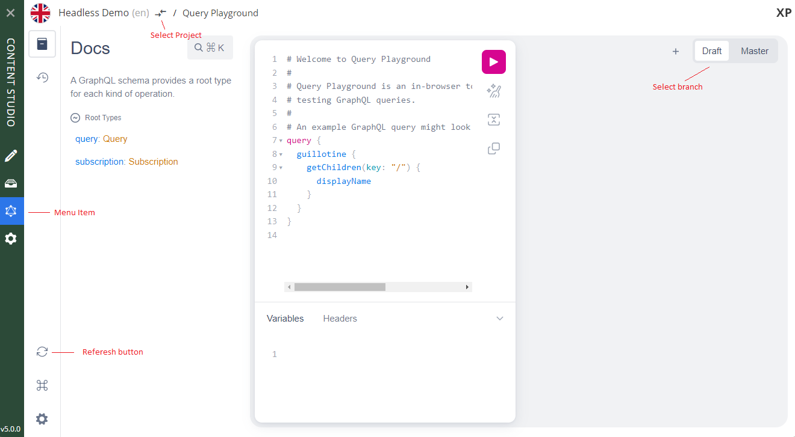

= Clients

There are GraphQL clients for virtually any programming language and platform. This section describes the most common ways of accessing the API

NOTE: The examples below assume you have installed the https://market.enonic.com/vendors/enonic/headless-movie-db[Headless Movie Database] demo app running on your local machine.

== Query Playground

The Guillotine app extends Content Studio with a new panel called Query Playground. This is only accessible for users with `system.admin` or `cms.admin` roles.

Query Playground lets you run queries in context of your content. You may choose to query either the draft items (draft branch), or the published items (master branch).

* The left panel is used to display documentation generated from the GraphQL API
* The center panel allows you to edit your GraphQL query
* The right panel displays the result of the query execution
* Branch selector (Draft/Master) can be found in the top right corner
* Each query is executed in a specific context, which is determined by the project and the branch

=== Query example

* Paste the query below inside the left panel.
+
This query can be read as: Retrieve the display name and type of the root items.
* Click on the query play button above
* The service response is displayed in the center panel

.getSite
[source,graphql]
----
{
  guillotine{
 	getChildren(key:"/") {
 	  displayName
 	}
  }
}
----

== cURL

TIP: cURL must be installed on your device for the examples below to work

=== Query example

.Create the file req.json
[source,json]
----
{"query":"query {\n  guillotine {\n    queryDsl(query: {\n      term: {\n        field: \"type\",\n        value: {\n          string: \"com.enonic.app.moviedb:playlist\"\n        }\n      }\n    }){\n      ... on com_enonic_app_moviedb_Playlist {\n        _id\n        displayName\n      }\n    }\n  }\n}"}
----

.POST request using cURL
[source,curl]
----
curl -X POST -H "Content-Type: application/json" -d @req.json http://localhost:8080/site/moviedb/draft | json_pp
----

.Response
[source,json]
----
{
  "data": {
    "guillotine": {
      "queryDsl": [
        {
          "_id": "531e40c9-6e5b-4259-b9e0-0d3144b2382a",
          "displayName": "CTO's favorite movies"
        }
      ]
    }
  }
}
----

== JavaScript

This section describes how to access the Guillotine API directly from a JavaScript client.

=== Example: Fetch content by type

In our example, we will use the `http://localhost:8080/site/moviedb/master` endpoint to make a request to the GraphQL API. More information about endpoints can be found <<endpoints#, here>>.

This endpoint expects to receive an HTTP POST request with the following properties in the body of the request:

* A mandatory "query" String
* An optional "variables" Object

.Example: Fetch data from a javascript client
[source,javascript]
----
const query = `query($type:String){
    guillotine {
        queryDsl(query: {
          term: {
            field: "type",
            value: {
              string: $type
            }
          }
        }){
          ... on com_enonic_app_moviedb_Playlist {
            _id
            displayName
          }
        }
    }
}`;

const variables = {
    'type': 'com.enonic.app.moviedb:playlist'
};

fetch('http://localhost:8080/site/moviedb/master', {
    method: 'POST',
    body: JSON.stringify({
        query: query,
        variables: variables
    }),
    credentials: 'same-origin'
})
    .then(response => response.json())
    .then(console.log);
----
