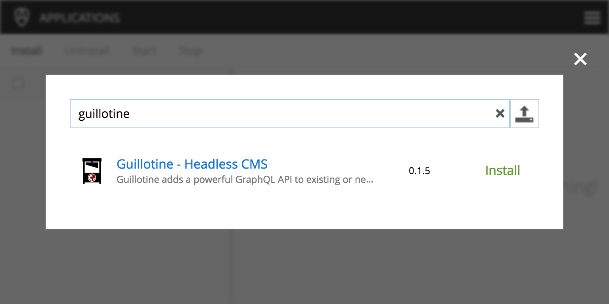

= Guillotine Headless CMS

By adding this application to your existing site, 
it will generate a dynamic GraphQL API that enables web-based access to all your editorial content.

Guillotine exposes the read-only part of the Enonic Content API, including access to the Enonic query language. 
Guillotine dynamically analyzes all available content types in the site and generates a GraphQL API specific to your site. 
This gives you direct, typed and documented access to all content within the site. Including the ability to follow references, 
child items and access media directly.

[NOTE]
==== 
This application is built on the Guillotine library. For details on the API or integrating Guillotine into your own app, check out  
https://developer.enonic.com/docs/apis/guillotine-headless-cms-library[the Guillotine library documentation...]
====

== Installation

* Open the admin tool "Applications"
* Search for the "guillotine" application
* Click on "install"

== Configuration

* Open the admin tool "Content Studio"
* Edit a site
* Add the application "Guillotine"

image::images/configuration.png[Installation,768,576]

== Browse you API using GraphiQL

The easiest way to manually explore a GraphQL API and test GraphQL queries is to use GraphiQL

[NOTE]
==== 
GraphQL is a query language developed by Facebook. 
This technology allows Guillotine to provide a single and exhaustive API 
while allowing you to retrieve all the content information you need in one request without any superfluous information

http://graphql.org/learn[Learn more about GraphQL...]
====

=== Installation 

* Open the admin tool "Applications"
* Search for the "graphiql" application
* Click on "install"
* Open the admin tool "GraphiQL"

image::images/graphiql.png[GraphiQL,768,384]

=== User Interface

* The field 'Service Location' specifies the location of the GraphQL service. 
+
By default, it is prefilled with one of your configured sites for the branch "draft".
* The left panel allows you to edit your graphQL query
* The center panel displays the result of the query execution
* The right panel is used to display a documentation generated from the GraphQL API.

=== Usage example

* Write the query below inside the left panel.
+
This query can be read as: Retrieve the display name and type of the current content.
* Click on the query execution button above
* The service response is displayed in the center panel

----
{
  guillotine {
    get {
      displayName
      type
    }
  }
}
----

image::images/graphiql-example.png[Example,768,384]

== Accessing the API with Javascript

To use your GraphQL service, your client will send all its requests to the same service.
The service is expecting to receive a POST request with inside its body:

* A mandatory "query" String
* An optional "variables" Object

.Example: Generate a service URL from a controller
[source,javascript]
----
var portalLib = require('/lib/xp/portal');
var graphqlServiceUrl = portalLib.serviceUrl({
    service: 'graphql'
});
----

.Example: Fetch data from a javascript client
[source,javascript]
----
const query = `query($path:ID!){
    guillotine {
        get(key:$path) {
            displayName
            type
        }
    }
}`;

const variables = {
    'path': '/mycontentpath'
};

fetch('{{graphqlServiceUrl}}', {
    method: 'POST',
    body: JSON.stringify({
        query: query,
        variables: variables
    }),
    credentials: 'same-origin'
})
    .then(response => response.json())
    .then(console.log);
----