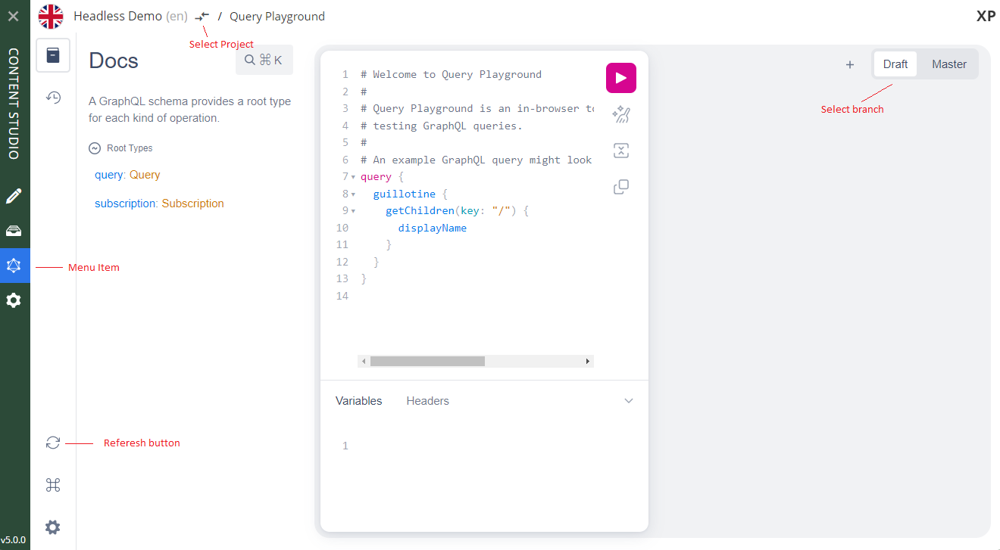

= Query Playground

Access and test the API via the embedded API browser

== Content Studio Extension

Guillotine extends Content Studio with a new panel called Query Playground. It is only accessible for users with the `system.admin` or `cms.admin` roles.

== Enonic SDK

When using Enonic SDK, Query Playground is also available directly on the project URL: `http://localhost:8080/site/<project>`.

It can also be enabled for production servers via <<configuration#, configuration>>.

== API browser

Query Playground lets you access the detailed documentation, and peform queries in context of your content:

Left panel:: GraphQL API documentation
Center panel:: Edit your GraphQL query
Right panel:: Displays query results
Branch selector:: Toggle between querying Draft and Master branches
+
NOTE: Each query is executed in a specific context, which is determined by the project and the branch.

=== Query example

Try out this query for a start.

. Paste the query below inside the left panel.
. Click on the query play button above
. The service response is displayed in the center panel

.Retrieve the displayName and type of the root items.
[source,graphql]
----
{
  guillotine{
 	getChildren(key:"/") {
 	  displayName
 	}
  }
}
----

There are more examples available in the <<usage#, Usage section>>.

