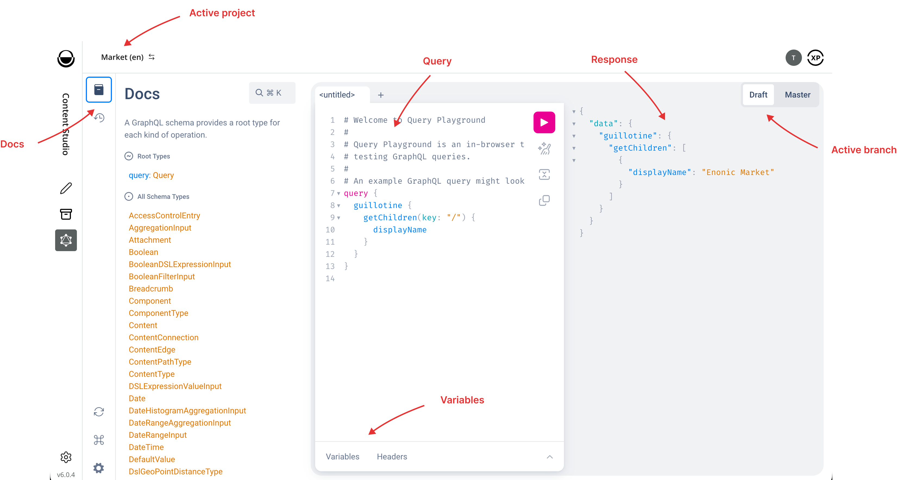

= Query Playground

Explore your schema and test queries in Content Studio.

== Content Studio Extension

Guillotine extends Content Studio with a new panel called Query Playground. It is only accessible for users with the `system.admin` or `cms.admin` roles.

NOTE: Guillotine 9 removes the playground previously served by GET requests to the GraphQL endpoint. The Content Studio extension described here remains available. To explore the API outside Content Studio, use a <<usage#third-party-clients, third-party GraphQL client such as Altair>>.

== API browser

Query Playground lets you access the detailed documentation, and perform queries in context of your content:

Left panel:: GraphQL API documentation
Center panel:: Edit your GraphQL query
Right panel:: Displays query results
Branch selector:: Toggle between querying Draft and Master branches
+
NOTE: Each query is executed in a specific context, which is determined by the project and the branch.

=== Query example

Try out this query for a start.

. Paste the query below inside the center panel.
. Click on the query play button above
. The service response is displayed in the right panel

.Retrieve the displayName and type of the root items.
[source,graphql]
----
{
  guillotine {
    getChildren(key: "/", first: 10) {
      displayName
      type
    }
  }
}
----

See <<usage/content-queries#, Content queries>> for more query examples, or <<usage#, Usage>> to send queries from your own client.
