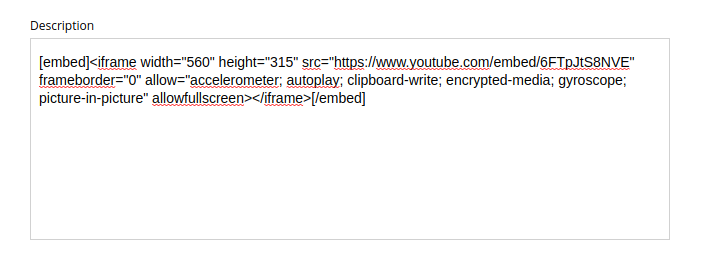
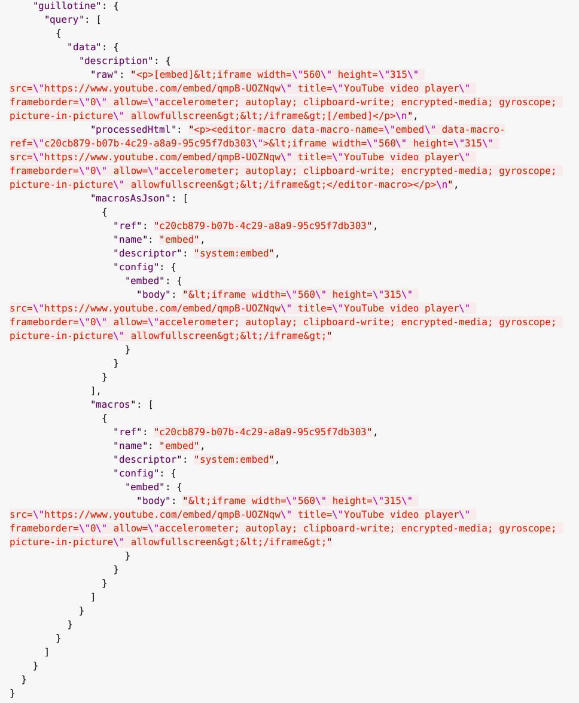
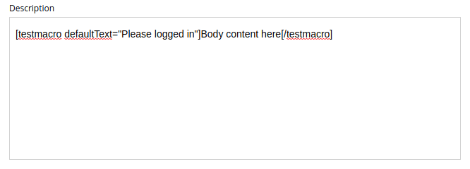

= Using the Guillotine API

Example queries when using Guillotine

TIP: Visit our https://developer.enonic.com/docs/developer-101[Developer 101 tutorial] for detailed introduction to Enonic and use of the Guillotine API

== Introduction

The Guillotine API and GraphQL schema dynamically adapt to your content model, the examples below are based on a fictional content model and content structure.

TIP: Here are details on how to invoke the API from <<usage/javascript#, JavaScript>> or command line via <<usage/curl#, cURL>>

Below is a selection of sample GraphQL queries:

== Content queries

Enonic offers advanced search and aggregation queries using https://developer.enonic.com/docs/xp/stable/storage/dsl[Query DSL] (Domain Specific Language). Ranked search, aggregations and highlighting are just some of the features.

.*Query DSL example*: Simple query to fetch blog posts from the app "com.enonic.app.myapp". For each post, return its display name and the display name of the referenced author
[source,graphql]
----
{
  guillotine {
    queryDsl(query: {
          term: {
            field: "type",
            value: {
              string: "com.enonic.app.myapp:Post"
            }
          }
        }){
      ... on com_enonic_app_myapp_Post {
        displayName
      }
    }
  }
}
----

== Follow references

References between content items are available via regular GraphQL fields, allowing you to traverse and extract details from referenced content.

By default, each item has the following common reference fields:

* `parent`: the parent content item
* `children`: the child item(s) if any

Schemas with ContentSelector, MediaSelector or ImageSelector will generate references to the target item(s).

.*Query example*: Retrieve the display name of a specific content and the display name of its direct children
[source,graphql]
----
{
  guillotine {
    get(key: "/path/to/item") {
      displayName
      children {
        displayName
      }
    }
  }
}
----

== Accessing images

Enonic XP can serve custom scaled images at runtime. Guillotine uses this functionality by using the `imageUrl` field which will generate a URL for the desired image size and crop.

.*Example: Scaled Image URL* - Retrieve the image contents and generate absolute URLs to these images cropped to 800x200px
[source,graphql]
----
{
  guillotine {
    queryDsl(query: {
          term: {
            field: "type",
            value: {
              string: "media:image"
            }
          }
        }){
        displayName
        ... on media_Image {
          imageUrl(scale:"block(800,200)",type:absolute)
        }
    }
  }
}
----

== Rich text

Rich text fields provide configuration parameters that give you control over output from links, images and much more.

.*Example: Process HTML* - Retrieve the blog posts. For each post, return its author display name, tags and processed content.
[source,graphql]
----
{
  guillotine {
    queryDsl(query: {
          term: {
            field: "type",
            value: {
              string: "com.enonic.app.myapp:post"
            }
          }
        }){
      ... on com_enonic_app_myapp_Post {
        data {
          author {
            displayName
          }
          tags
          post(processHtml:{type:absolute}) {
             processedHtml
          }
        }
      }
    }
  }
}
----

Rich text fields will typically include links, images and macros in the `processedHtml` field of the <<api#richtext, RichText>> type. Below are further details how to handle this:

=== Links

By default, all internal links to `media` or `content` will be replaced by an absolute (`server`) link relative to the context of your endpoint.

For each `a` tag a `data-link-ref` attribute with referenced content Id will be added. Additional content related to the `links` field is available for custom processing by your client.

For instance, the processed value of a link looks like this:

[source,html]
----

    <a title="Tooltip"
        href="/admin/site/preview/hmdb/draft/hmdb/persons/lea-seydoux"
        data-link-ref="e72f48b6-a972-4133-a300-a3ab5d132800">Link 1</a>

----

The GraphQL query below will process links inside the field:

[source,graphql]
----
query {
  guillotine {
    get(key: "contentID") {
      ... on com_app_example_ContentType {
        data {
          htmlAreaField {
            links {
              ref          // <1>
              uri          // <2>
              media {      // <3>
                content {
                 _id
                }
                intent     // <4>
              }
              content {    // <5>
                _id
              }
            }
          }
        }
      }
    }
  }
}
----
<1> Reference to link in the `processedHtml` field
<2> Link URI
<3> Related media content. This field has `null` value for non-media content
<4> Link intent. Available values `download` and `inline`
<5> Related content. This field has `null` value for media content

=== Images

Guillotine by default provides image processing in the `processedHtml` field of the RichText GraphQL type. All internal links to resources will be replaced by an absolute (`server`) link and for each `img` tag a `data-image-ref` attribute with referenced content Id will be added.
Using that reference you will be able to find image details in the `images` field and implement custom image processing, if needed.

For instance, the processed value of an image looks like this:

[source,html]
----
<figure class="editor-align-justify">
    
    <figcaption>Caption text</figcaption>
</figure>
----

The query below will process images inside the field:

[source,graphql]
----
query {
  guillotine {
    get(key: "contentID") {
      ... on com_app_example_ContentType {
        data {
          richTextField {
            images {
              ref                           // <1>
              image {                       // <2>
                ... imageFragment
              }
              style {                       // <3>
                name
                aspectRatio
                filter
              }
            }
          }
        }
      }
    }
  }
}

fragment imageFragment on Content {
  _id
  type
  ... on media_Image {
    data {
      caption
    }
  }
  ... on media_Vector {
    data {
      caption
    }
  }
}
----
<1> Reference to an image in the `processedHtml` field
<2> Image as <<api#content, Content>> type
<3> Image style as <<api#imagestyle, ImageStyle>> type

Using the `processHtml` argument which has <<api#processhtmlinput, ProcessHtmlInput>> type for a form item of type `HtmlArea` or for
`TextComponent` field you can specify `imageWidths` to generate relevant links for specific widths of an image.
In this case `srcset` attribute will be added to `img` tags.

For instance, when using the following fragment of query:

[source,graphql]
----
htmlAreaField(processHtml: { imageWidths: [600, 992] }){
    processedHtml
    images {
      ref
    }
}
----

The result will look as follows:

[source,html]
----
<figure class="editor-align-justify">
    
    <figcaption>Caption text</figcaption>
</figure>
----

=== Macros

Each macro will be translated to an `editor-macro` tag with `data-macro-ref` and `data-macro-name` attributes in the `processedHtml` field value. Using these references you will be able to find details of a specific macro in the `macrosAsJson` or `macros` fields and implement custom macro processing if needed.

[NOTE]
====
Guillotine processes macros which have a descriptor and built-in macros called `disable` and `embed`, otherwise processing will be skipped. https://developer.enonic.com/docs/xp/stable/cms/macros[More details about macros].
====

For instance, we have an input form item called `description` of `HtmlArea` type which contains the `embed` macro as shown below:

The query below will fetch data for the `description` field:

[source,graphql]
----
query {
  guillotine {
    get(key: "contentID") {
      ... on com_app_example_ContentType {
        data {
          description {
            raw            // <1>
            processedHtml  // <2>
            macrosAsJson   // <3>
            macros {       // <4>
              ref
              name
              descriptor
              config {
                embed {
                  body
                }
              }
            }
          }
        }
      }
    }
  }
}
----
<1> Non-processed value of the `description` field
<2> Processed value of the `description` field
<3> Array of processed macros in JSON format. The order of macros will be the same as in the `raw` and `processedHtml` fields.
<4> <<api#macro, Macro>> allows to specify necessary fields. That field is an alternative for `macroAsJson` field

Results of the query:

It is common to define a https://developer.enonic.com/docs/xp/stable/cms/macros#descriptor[schema for your macro]. This is located in the `/site/macros/` directory. For instance, for a macro with name `testmacro` the schema must be placed at `/site/macros/testmacro/testmacro.xml`

[source,xml]
----
<macro>
  <display-name>Current user</display-name>
  <description>Shows currently logged user</description>
  <form>
    <input name="defaulttext" type="TextLine">
      <label>Text to show if no user logged in</label>
    </input>
  </form>
</macro>
----

Executing the query below will give your value of the `defaultText` input, as defined in the above schema.

[source,graphql]
----
query {
  guillotine {
    get(key: "contentID") {
      ... on com_app_example_ContentType {
        data {
          description {
            macros {
              ref
              name
              descriptor
              config {
                testmacro {
                  defaultText
                }
              }
            }
          }
        }
      }
    }
  }
}
----

== xData

Enonic XP supports dynamically extending content with fields from other schemas/applications - so-called https://developer.enonic.com/docs/xp/stable/cms/x-data[eXtra Data].

In the query below, we access the SoMe (SocialMedia) fields that have been used to extend the Person content type.

.Example: Access xData fields
[source,graphql]
----
{
  guillotine {
    query(key: "contentID") {
      displayName
      x {
      	com_example_myproject {
          SoMe {
          	imdb
          }
        }
      }
    }
  }
}
----

NOTE: Notice that xData fields are grouped by application name, this ensures there will never be a conflict between field names, even when schemas come from different applications.

== Site context

When building websites, you will create root content item of type `site`. It is practical not having to know the exact location of the site within the project structure.

By passing a special HTTP header along the query, you get access to some useful features:

=== Set header

You need to specify the following HTTP header in your client:

  X-Guillotine-SiteKey: IdOrPathToYourSite

Using Query playground, add the following to the HTTP headers config - remember to replace with a proper site ID:

  {
    "X-Guillotine-SiteKey": "IdOrPathToYourSite"
  }

NOTE: SiteKey is either the ID of the site content item, or the path to the site within your project.

=== getSite

With the site context set, you may run queries to access the site content using getSite field

.Example: Accessing the displayName of the site
----
{
  guillotine {
    getSite{
        displayName
    }
  }
}
----

=== Path placeholder

Use the `${site}` placeholder when querying for paths within a site. This placeholder will be replaced with an actual path of the site upon query resolution.

NOTE: `${site}` placeholder is supported for the fields `get`, `getChildren`, `getChildrenConnection`, `getPermissions` and `getSite` of the <<api#headlessCms, HeadlessCms>> type. The `getPermissions` and `getSite` fields do not have the `key` argument, and current content is determined by the `X-Guillotine-SiteKey` header or the `siteKey` argument of the `guillotine` field. The same applies to the `get`, `getChildren`, and `getChildrenConnection` fields if the `key` argument is not provided.

.Example: Accessing content within specific path of a site
----
{
  guillotine {
    getChildren(key: "${site}/persons"){
      displayName
      ... on com_example_myproject_Person {
        data {
          dateofbirth
        }
      }
    }
  }
}
----

=== Site relative paths

Finally, you may retrieve site relative paths - which may be useful when generating site relative URLs for instance.

.Example: Retrieve site relative item paths
----
{
  guillotine {
    getChildren(key: "${site}/persons"){
      displayName
      _path(type: siteRelative)
    }
  }
}
----

=== siteKey

Instead of passing the `X-Guillotine-SiteKey` header as described above, you can simply provide `siteKey` with the site ID or path in the query as shown in the example below:

.Example: Access xData fields
[source,graphql]
----
{
  guillotine(siteKey: "/my-site") {
    get(key: "${site}") {
      displayName
      children {
        displayName
        type
      }
    }
  }
}
----
